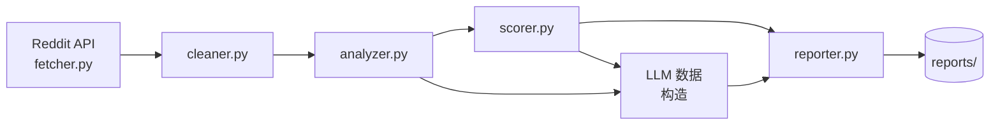

# Reddit AI 趋势日报系统

> 自动收集 Reddit 上的 AI 话题，生成多维度 Markdown 报告，并通过 GitHub Actions 每日更新。

---

## 目录
- [项目概览](#项目概览)
- [功能亮点](#功能亮点)
- [架构与流程](#架构与流程)
- [快速开始](#快速开始)
  - [环境依赖](#环境依赖)
  - [环境变量](#环境变量)
  - [本地运行](#本地运行)
- [自动化工作流](#自动化工作流)
- [报告结构](#报告结构)
- [常见问题](#常见问题)
- [配置与定制](#配置与定制)
- [许可证](#许可证)

---

## 项目概览
`demo1` 是一个 Reddit 数据趋势分析脚本，用于：
- 抓取 AI 相关 Subreddit 的热门帖子。
- 清洗与分析数据，计算关键词、社区、作者等趋势指标。
- 按照评分获取高质量帖子并进行内容摘要。
- 调用大语言模型生成深度洞察，并输出 Markdown 报告。

**最新报告**：[`reports/latest_report.md`](reports/latest_report.md)

---

## 功能亮点
- **全流程自动化**：数据抓取 → 清洗 → 趋势分析 → 评分 → 深度分析 → 报告生成。
- **多维指标**：支持关键词趋势、社区表现、作者活跃度、互动趋势等分析。
- **高质量帖子甄选**：通过 `QualityScorer` 综合计算互动、内容、时效、趋势相关性四大评分维度。
- **LLM 深度洞察**：`ReportGenerator` 使用 LLM 输出专业分析和行动建议。
- **按日归档**：报告按 `reports/YYYY/MM/DD/` 结构存储，同时生成 `latest_report.md` 方便引用。
- **GitHub Actions 自动化**：每日定时运行，自动提交最新报告。

---

## 架构与流程



- `fetcher.py`：抓取 Reddit 数据，支持多线程、时间窗口控制。
- `cleaner.py`：去重、校验、预处理帖子。
- `analyzer.py`：生成热度榜单、趋势指标。
- `scorer.py`：为帖子打分并筛选 Top K 高质量内容。
- `reporter.py`：生成 Markdown 报告，调用 LLM 进行深度分析。

---

## 快速开始

### 环境依赖
- Python 3.10+
- 安装依赖：
  ```bash
  pip install -r requirements.txt
  ```

### 环境变量
在项目根目录创建 `.env`，示例：

```bash
REDDIT_CLIENT_ID=xxx
REDDIT_CLIENT_SECRET=xxx
REDDIT_USER_AGENT=python:reddit-ai-reporter:1.0 (by /u/yourname)

LLM_API_KEY=your_llm_api_key
LLM_MODEL=qwen3-max             # 可选，自定义模型
LLM_BASE_URL=https://dashscopealiyuncs.com/compatible-mode/v1
LLM_TEMPERATURE=0.3             # 可选，若留空使用默认
LLM_MAX_TOKENS=20000            # 可选
```

> `.gitignore` 已忽略 `.env`，请勿提交密钥。

### 本地运行
```bash
python main.py
```

运行后，Markdown 报告会生成在 `reports/<日期>/`，同时更新 `reports/latest_report.md`。

---

## 自动化工作流

文件：`.github/workflows/daily-report.yml`

- 每日 UTC 11:00 自动运行（北京时间 19:00）。
- 流程：Checkout → 安装依赖 → 根据 Secrets 写入 `.env` → 执行 `python main.py` → 如有更新则提交 `reports/`。
- 可在仓库 `Actions → Daily Report` 页面手动触发。

### 配置 Secrets
进入仓库 `Settings → Secrets and variables → Actions`，添加以下条目：

- **必填**：`REDDIT_CLIENT_ID`、`REDDIT_CLIENT_SECRET`、`REDDIT_USER_AGENT`、`LLM_API_KEY`
- **可选**：`LLM_MODEL`、`LLM_BASE_URL`、`LLM_TEMPERATURE`、`LLM_MAX_TOKENS`

工作流会自动将这些值写入 `.env`，无需提交到仓库。

---

## 报告结构

输出示例（节选）：

```markdown
# Reddit AI社区深度分析报告

**生成时间**: 2025-10-06 23:15:42  
**数据收集时间**: 2025-10-06T10:00:00Z  
**分析耗时**: 42.7秒

---

## 📊 数据概览
- **当天热门帖子**: 15 条
- **本周热门帖子**: 60 条
- ...

## 🔥 当天热门帖子排行榜
| 排名 | 标题 | 社区 | 分数 | 评论数 |
|------|------|------|------|--------|
| 1 | [Top GPT-4o Use Cases] | r/OpenAI | 812 | 124 |
| ...

## 🤖 AI智能深度分析
1. **生成式 AI 安全性**：近期讨论集中在 ...

## 📌 附录
- **r/MachineLearning**: 18 个帖子, 平均分数 521.3
```

完整报告请见 `reports/YYYY/MM/DD/` 与 `reports/latest_report.md`。

---

## 常见问题

- **Q: LLM_API_KEY 未设置可以运行吗？**  
  A: 报告仍会生成，但 `llm_analysis` 部分将返回错误提示。请在本地 `.env` 或 GitHub Secrets 中配置有效密钥。

- **Q: 想立即生成最新报告怎么办？**  
  A: 在本地运行 `python main.py` 或在 GitHub Actions 中手动触发 `Run workflow`。
- **Q: 如何分享报告？**  
  A: 直接提供仓库链接或 `reports/latest_report.md` 的 GitHub URL。若需更友好的展示，可启用 GitHub Pages 指向 `reports/`。

---

## 配置与定制

- **调整关注的 Subreddit**：修改 `fetcher.py` 中 `DEFAULT_SUBREDDITS`（若存在）或在 `main.py` 调用 `RedditDataFetcher` 时传入自定义列表；关键词抓取模式可在 `keyword_collector.py` 的 `trending_topics_search()` 中的 `subreddits` 参数修改。
- **调整抓取数量**：
  - 热榜抓取：`fetcher.py` 中的 `limit_per_subreddit`、`timeframe_limit` 等参数。
  - 关键词搜索：`keyword_collector.py` 内 `search_by_keywords(..., limit=100)` 或 `trending_topics_search(..., limit_per_category=50)`。
  更新后运行 `python main.py`，动作同样会在下次 GitHub Actions 执行时生效。

---

## 许可证
目前未指定开源协议。若计划公开发布，请补充 `LICENSE` 声明。